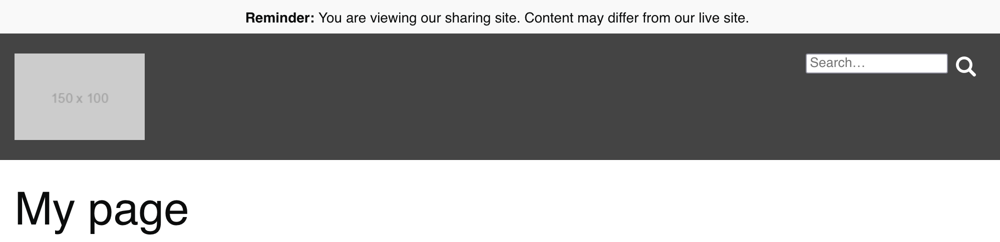

[](https://travis-ci.org/cfpb/wagtail-sharing) [](https://coveralls.io/github/cfpb/wagtail-sharing?branch=master)

# wagtail-sharing

Easier sharing of [Wagtail](https://wagtail.io) drafts.

`wagtailsharing` makes it easier to share Wagtail draft content for review by users who can't necessarily login to or use the full Wagtail admin site. This lets you do things like host Wagtail on mysite.domain but host the most recent draft content on share.mysite.domain.

It works by replacing the default Wagtail [URL patterns](http://docs.wagtail.io/en/v1.8/getting_started/integrating_into_django.html#url-configuration) with a wrapper that displays a page's most recent draft content for certain incoming requests.

A simple banner is also added to the top of each page when draft content is being viewed to make sure users know that current published content may differ:



## Setup

1. Install the package using pip:
 
 ```
 pip install git+https://github.com/cfpb/wagtail-sharing.git
 ```
 
1. Add `wagtailsharing` as an installed app in your Django settings:

 ```py
 # in settings.py
 INSTALLED_APPS = (
     ...
     'wagtailsharing',
     ...
 )
```

1. Configure desired sharing settings (see below):

 ```py
 # in settings.py
 
 # This makes drafts visible to logged-in users or from requests to
 # a given hostname.
 WAGTAILSHARING_REQUEST_CHECKS = (
     'wagtailsharing.request_checks.LoggedInUserRequestCheck',
     'wagtailsharing.request_checks.HostnameRequestCheck',
 )
 
 WAGTAILSHARING_HOSTNAME = os.environ.get('WAGTAILSHARING_HOSTNAME')
 ```
 
1. Replace use of Wagtail's catch-all URL pattern:
 
 ```diff
 # in urls.py
 -from wagtail.wagtailcore import urls as wagtail_urls
 +from wagtailsharing import urls as wagtailsharing_urls
 
 ...
 
-urlpatterns.append(url(r'', include(wagtail_urls)))
+urlpatterns.append(url(r'', include(wagtailsharing_urls)))
 ```

## Request checks

The `settings.WAGTAILSHARING_REQUEST_CHECKS` setting specifies a list of checks to make against incoming requests to validate that they have permission to view draft pages. **Important: configuring this section wrong could expose draft/private content publicly. Be careful when configuring this part!**

The list should contain the full classnames of check classes to invoke against the incoming Django `HttpRequest` object. If **any** of these checks pass, the request is considered authorized to view draft content. Built-in classes include:

- `wagtailsharing.request_checks.LoggedInUserRequestCheck`

 Any logged-in users will see the latest draft when visiting a page instead of the latest published content.

- `wagtailsharing.request_checks.StaffUserRequestCheck`

 Staff users (verified by checking `user.is_staff`) will see the latest draft when visiting a page instead of the latest published content.

- `wagtailsharing.request_checks.HostnameRequestCheck`

 Requests coming from a hostname matching `settings.WAGTAILSHARING_HOSTNAME` exactly (using `request.get_host()`, which notably includes the port, e.g. `sharing.my.domain:8000`) will see the latest draft when visiting a page instead of the latest published content.

### Writing your own request checks

You can write your own request check class by defining a new object that has a `verify_request` method:

```py
class SpecificUserRequestCheck(object):
    def verify_request(self, request):
        return request.user.username == 'admin'
```

## Compatibility

This project has been tested for compatibility with:

- Python 2.7, 3.5
- Django 1.8, 1.9, 1.10
- Wagtail 1.6, 1.7, 1.8

## Open source licensing info
1. [TERMS](TERMS.md)
2. [LICENSE](LICENSE)
3. [CFPB Source Code Policy](https://github.com/cfpb/source-code-policy/)
