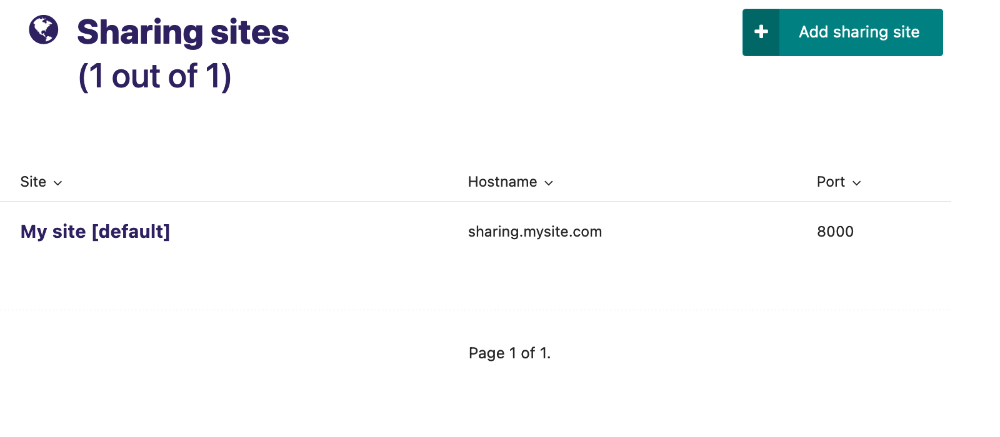

[](https://travis-ci.org/cfpb/wagtail-sharing) [](https://coveralls.io/github/cfpb/wagtail-sharing?branch=master)

# wagtail-sharing

Easier sharing of [Wagtail](https://wagtail.io) drafts.

Wagtail Sharing makes it easier to share Wagtail draft content for review by users who don't have access to the Wagtail admin site. It allows you to define an alternate hostname and/or port on which to expose the latest revision of all of your Wagtail pages.

For example, let's say your Wagtail site is running on http://mysite.com. You've created a draft page at slug `/path/to/draft`, but haven't yet published it. Wagtail Sharing lets you expose that draft page at some other domain, for example http://sharing.mysite.com/path/to/draft.

In another use case, you might have a published page at http://mysite.com/already/published/page, and you've made some draft changes. Wagtail Sharing lets you expose those draft changes at http://sharing.mysite.com/already/published/page while still keeping the same published content at your regular domain.

These examples obviously work best when you have some method of restricting access to http://sharing.mysite.com, for example by only exposing that subdomain on a private network.

Wagtail Sharing lets you create separate sharing sites for each Wagtail Site you have defined. It also supports a configurable visual banner on shared pages to remind reviewers that content may differ from your published site.

## Setup

1. Install the package using pip:
 
 ```sh
 pip install git+https://github.com/cfpb/wagtail-sharing.git
 ```
 
1. Add `wagtailsharing` as an installed app in your Django settings:

 ```py
 # in settings.py
 INSTALLED_APPS = (
     ...
     'wagtailsharing',
     ...
 )
```

1. Run migrations to create required database tables:

 ```sh
 $ manage.py migrate wagtailsharing
 ```

 
1. Replace use of Wagtail's catch-all URL pattern:
 
 ```diff
 # in urls.py
 -from wagtail.wagtailcore import urls as wagtail_urls
 +from wagtailsharing import urls as wagtailsharing_urls
 
 ...
 
-urlpatterns.append(url(r'', include(wagtail_urls)))
+urlpatterns.append(url(r'', include(wagtailsharing_urls)))
 ```

## Sharing sites

The Wagtail admin now contains a new section under Settings called Sharing Sites that allows users to define how they would like to expose latest page revisions. 



No sharing sites exist by default. A sharing site must be manually created for each Wagtail Site to make its latest revisions shareable. Each sharing site is defined by a unique hostname and port number. **Important: configuring your sharing sites improperly could expose draft/private content publicly. Be careful when setting them up!**

## Banners

Pages viewed on a wagtail-sharing shared site have a simple banner added to them to remind reviewers that the current published content may differ from the content they are viewing.


This behavior can be disabled by setting `settings.WAGTAILSHARING_BANNER = False`.  The banner template can be overridden by providing an alternate template file at `wagtailsharing/banner.html` similar to how [wagtailadmin template overrides](http://docs.wagtail.io/en/latest/advanced_topics/customisation/admin_templates.html#customising-admin-templates) are supported.

## Compatibility

This project has been tested for compatibility with:

- Python 2.7, 3.5
- Django 1.8, 1.9, 1.10
- Wagtail 1.6, 1.7, 1.8, 1.9

## Open source licensing info
1. [TERMS](TERMS.md)
2. [LICENSE](LICENSE)
3. [CFPB Source Code Policy](https://github.com/cfpb/source-code-policy/)
