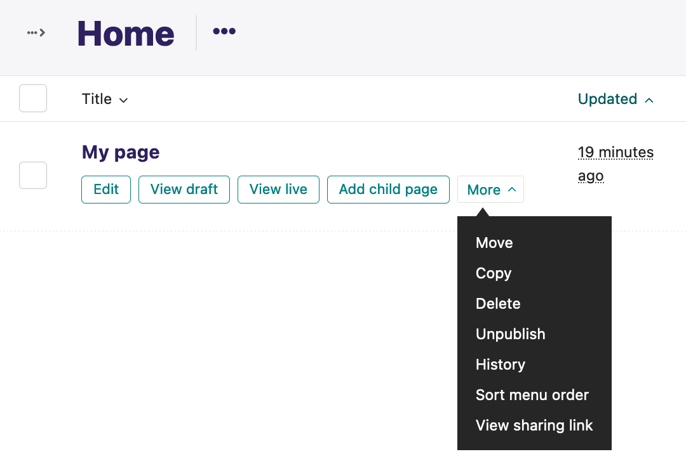

.. image:: https://github.com/cfpb/wagtail-sharing/workflows/test/badge.svg?branch=main
  :alt: Build Status
  :target: https://github.com/cfpb/wagtail-sharing/actions?query=branch%3Amain+workflow%3Atest+

wagtail-sharing
===============

Easier sharing of `Wagtail <https://wagtail.org>`_ drafts.

Wagtail Sharing makes it easier to share Wagtail draft content for review by users who don't have access to the Wagtail admin site. It allows you to define an alternate hostname and/or port on which to expose the latest revision of all of your Wagtail pages.

For example, let's say your Wagtail site is running on http://mysite.com. You've created a draft page at slug ``/path/to/draft``, but haven't yet published it. Wagtail Sharing lets you expose that draft page at some other domain, for example http://sharing.mysite.com/path/to/draft.

In another use case, you might have a published page at http://mysite.com/already/published/page, and you've made some draft changes. Wagtail Sharing lets you expose those draft changes at http://sharing.mysite.com/already/published/page while still keeping the same published content at your regular domain.

These examples obviously work best when you have some method of restricting access to http://sharing.mysite.com, for example by only exposing that subdomain on a private network.

Wagtail Sharing lets you create separate sharing sites for each Wagtail Site you have defined. It also supports a configurable visual banner on shared pages to remind reviewers that content may differ from your published site.

This new logic only applies to ``GET`` requests. Other HTTP methods like ``POST`` defer to standard Wagtail handling.

Routing configuration
---------------------

Wagtail Sharing supports different routing strategies for determining how
draft pages are shared.

Database-based routing (default)
~~~~~~~~~~~~~~~~~~~~~~~~~~~~~~~~

The default routing strategy uses sharing sites stored in the database,
using a new ``wagtailsharing.SharingSite`` model.
This approach allows for configuration of different sharing domains
for different Wagtail sites.

.. code-block:: python

  WAGTAILSHARING_ROUTER = "wagtailsharing.routers.db.DatabaseHostRouter"

With database-based routing, Wagtail adds a new admin section under
Settings -> Sharing Sites that allows users to define how they would like to expose latest page revisions.

.. image:: ./docs/images/sharing-sites.png
    :width: 640px
    :alt: Sharing sites

No sharing sites exist by default. A sharing site must be manually created for each Wagtail Site to make its latest revisions shareable. Each sharing site is defined by a unique hostname and port number.

In the above configuration,
drafts will be viewable at http://sharing.mysite.com:8000/.

Settings-based routing
~~~~~~~~~~~~~~~~~~~~~~

Sharing can also be configured via Django settings.
This approach avoids the need to configure sharing via the database,
but only works for the default Wagtail site.

.. code-block:: python

  WAGTAILSHARING_ROUTER = "wagtailsharing.routers.settings.SettingsHostRouter"
  WAGTAILSHARING_HOST = "http://sharing.mysite.com:8000"

With this configuration,
draft pages will also be viewable at http://sharing.mysite.com:8000/.

Specify multiple hosts as a list or comma-delimited string
to share the default Wagtail site on multiple domains:

.. code-block:: python

  WAGTAILSHARING_ROUTER = "wagtailsharing.routers.settings.SettingsHostRouter"
  WAGTAILSHARING_HOST = [
      "http://sharing.mysite.com:8000",
      "http://sharing2.mysite.com:8000",
  ]

Custom routing
~~~~~~~~~~~~~~

A custom router can be used for alternative routing strategies.
For example, you might want to route based on authentication tokens,
query parameters, or other criteria beyond hostname matching.

To create a custom router,
inherit from ``wagtailsharing.routers.base.RouterBase``
and implement the required methods:

.. code-block:: python

  from wagtailsharing.routers.base import RouterBase

  class CustomRouter(RouterBase):
      def route(self, request, path):
          # Returns (Site, path) tuple or (None, path) if no match.
          ...

      def get_sharing_url(self, page):
          # Returns the sharing URL for a given page.
          ...

Then configure it in your settings:

.. code-block:: python

  WAGTAILSHARING_ROUTER = "myapp.routers.CustomRouter"

Setup
-----

Install the package using pip:

.. code-block:: bash

  $ pip install wagtail-sharing

Add ``wagtailsharing`` as an installed app in your Django settings:

.. code-block:: python

  # in settings.py
  INSTALLED_APPS = (
      ...
      "wagtailsharing",
      ...
  )

Replace use of Wagtail's catch-all URL pattern:

.. code-block:: diff

  # in urls.py
  -from wagtail import urls as wagtail_urls
  +from wagtailsharing import urls as wagtailsharing_urls

  ...

  -urlpatterns.append(url(r"", include(wagtail_urls)))
  +urlpatterns.append(url(r"", include(wagtailsharing_urls)))

Database-based routing
~~~~~~~~~~~~~~~~~~~~~~

If you're using the default database-based routing, you'll also need to add
``wagtail.snippets`` to your installed apps:

.. code-block:: python

  # in settings.py
  INSTALLED_APPS = (
      ...
      "wagtail.snippets",
      "wagtailsharing",
      ...
  )

You'll also need to run migrations to create the required database tables:

.. code-block:: bash

  $ python manage.py migrate wagtailsharing

Settings-based routing
~~~~~~~~~~~~~~~~~~~~~~

If you're using settings-based routing,
you only need to add the router configuration to your settings:

.. code-block:: python

  WAGTAILSHARING_ROUTER = "wagtailsharing.routers.settings.SettingsHostRouter"
  WAGTAILSHARING_HOST = "http://sharing.mysite.com:8000"

Banners
-------

Pages viewed on a Wagtail Sharing shared site have a simple banner added to them to remind reviewers that the current published content may differ from the content they are viewing.

.. image:: ./docs/images/banner.png
    :alt: Banner

This behavior can be disabled by setting ``settings.WAGTAILSHARING_BANNER = False``.  The banner template can be overridden by providing an alternate template file at ``wagtailsharing/banner.html`` similar to how `wagtailadmin template overrides <http://docs.wagtail.io/en/latest/advanced_topics/customisation/admin_templates.html#customising-admin-templates>`_ are supported.

Sharing links
-------------

A page's sharing URL can be retrieved by calling the configured router's ``get_sharing_url`` method.

.. code-block:: python

  from wagtailsharing.routers import get_router

  sharing_url = get_router().get_sharing_url(page)

A page's sharing URL is based on the slug of its most recently published revision or, if the page has never been published, its initial revision.
This method returns ``None`` if the specified page is not routable
via the current routing configuration.

Shared pages will also have a new dropdown menu option that links to this sharing URL from the Wagtail page explorer.

Hooks
-----

 .. |before_serve_page| replace:: ``before_serve_page``
 .. _before_serve_page: http://docs.wagtail.io/en/latest/reference/hooks.html#before-serve-page

As with normal page serving, the serving of shared pages continues to respect Wagtail's built-in |before_serve_page|_ hook.

This project adds these additional hooks:

``before_route_page``
~~~~~~~~~~~~~~~~~~~~~~~~~~~~

Called when routing, before a page's ``route()`` method is called. This hook is passed the ``request`` and the ``page`` that will have ``route()`` called on it. If the callable returns an ``HttpResponse``, that response will be returned immediately to the user.

This hook allows for any necessary customization of Wagtail's built-in routing behavior, for example to support `ShareableRoutablePageMixin`_.

``before_serve_shared_page``
~~~~~~~~~~~~~~~~~~~~~~~~~~~~

Called before the latest revision of the page is about to be served, just before its ``serve()`` method is called. Like ``before_serve_page`` this hook is passed the page object, the request object, and the ``args`` and ``kwargs`` that will be passed to the page's ``serve()`` method. If the callable returns an ``HttpResponse``, that response will be returned immediately to the user.

This hook could be useful for limiting sharing to only certain page types or for modifying a page's contents when it is shared.

.. code-block:: python

  from wagtail import hooks

  @hooks.register("before_serve_shared_page")
  def modify_shared_title(page, request, args, kwargs):
      page.title += " (Shared)"

``after_serve_shared_page``
~~~~~~~~~~~~~~~~~~~~~~~~~~~

Called after the page's ``serve()`` method is called but before the response is returned to the user. This hook is passed the page object and the response object returned by ``serve()``. If the callable returns an ``HttpResponse``, that response will be returned immediately to the user.

This hook could be useful for directly modifying the response content, for example by adding custom headers or altering the generated HTML. This hook is used to implement the notification banner described above.

.. code-block:: python

  from wagtail import hooks

  @hooks.register("after_serve_shared_page")
  def add_custom_header(page, response):
      response["Wagtail-Is-Shared"] = "1"

Mixins
------

``ShareableRoutablePageMixin``
~~~~~~~~~~~~~~~~~~~~~~~~~~~~~~

 .. |RoutablePageMixin| replace:: ``RoutablePageMixin``
 .. _RoutablePageMixin: https://docs.wagtail.io/en/stable/reference/contrib/routablepage.html

Wagtail's |RoutablePageMixin|_ is not compatible with Wagtail Sharing, instead you need to use ``ShareableRoutablePageMixin`` in order to view shared draft content fields on routable pages.

``ShareableRoutablePageMixin`` is used exactly the same way as |RoutablePageMixin|_:

.. code-block:: python

  from wagtail.fields import RichTextField
  from wagtail.models import Page
  from wagtail.contrib.routable_page.models import route
  from wagtailsharing.models import ShareableRoutablePageMixin

  class EventIndexPage(ShareableRoutablePageMixin, Page):
      intro = RichTextField()

      @route(r"^$")
      def current_events(self, request):
          # …

      @route(r"^past/$")
      def past_events(self, request):
          # …

Compatibility
-------------

This project has been tested for compatibility with:

* Python 3.10+
* Django 4.2+
* Wagtail 6.2+

It should be compatible with all intermediate versions, as well.
If you find that it is not, please `file an issue <https://github.com/cfpb/wagtail-sharing/issues/new>`_.

See past releases for older Python/Django/Wagtail support.

Testing
-------

Running project unit tests requires `tox <https://tox.wiki/en/latest/>`_:

.. code-block:: bash

  $ tox

To run the test app interactively, run:

.. code-block:: bash

  $ tox -e interactive

Now you can visit http://localhost:8000/admin/ in a browser and log in with ``admin`` / ``changeme``.

Open source licensing info
--------------------------

#. `TERMS <https://github.com/cfpb/cfgov-refresh/blob/main/TERMS.md>`_
#. `LICENSE <https://github.com/cfpb/cfgov-refresh/blob/main/LICENSE>`_
#. `CFPB Source Code Policy <https://github.com/cfpb/source-code-policy>`_
